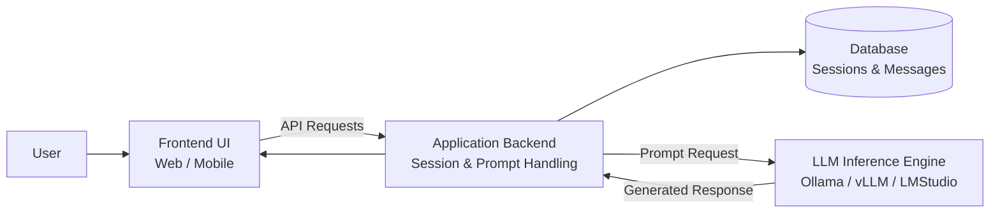

# ESBot – Case Study Description for Software Testing Course

## Introduction to the ESBot Application

The ESBot application is a conversational AI platform designed to provide users with an intuitive interface for interacting with modern large language models (LLMs). The system allows users to create chat sessions, submit prompts, and receive AI-generated responses in real time. ESBot focuses on providing a structured and accessible environment for conversational interaction with AI services while maintaining transparency and control over user sessions and stored data.

The platform is designed as a lightweight yet extensible application that demonstrates the integration of modern AI technologies within a typical software architecture. ESBot follows a three-tier architecture, separating the user interface, application logic, and AI inference layer. This modular design ensures maintainability, testability, and scalability while allowing individual system components to evolve independently.

A central element of ESBot is the chat session concept. Users interact with the system by creating chat sessions in which prompts and responses are exchanged with the AI system. Each session represents a structured conversation context that stores user prompts and generated responses. This enables users to review past interactions, continue conversations, and maintain context across multiple exchanges.

In addition to prompt processing, the system maintains a persistent history of conversations. This history is stored in a database and associated with the corresponding session, allowing users to revisit previous responses or continue conversations at a later time. The storage of prompts and responses also supports transparency and reproducibility of interactions, which is especially important when AI systems are used for educational or analytical purposes.

The AI responses generated by ESBot are produced by an external LLM inference service. The application layer communicates with this inference system through a dedicated interface. The inference engine may be implemented using modern tools such as Ollama, vLLM, or LMStudio, which provide local or hosted model execution. By separating the inference system from the core application logic, ESBot ensures flexibility in selecting different models while keeping the system architecture consistent.

While the primary focus of ESBot is conversational interaction, the platform also demonstrates the challenges associated with integrating AI services into software systems. These challenges include managing response latency, ensuring system reliability, validating inputs, and handling potentially unpredictable outputs from AI models.

The ESBot platform is intended as an educational example that illustrates how modern AI systems can be integrated into software architectures. It enables students to explore topics such as API testing, system integration, performance testing, automated testing pipelines, and security considerations within a realistic application context.

By focusing on a clear architecture and a limited but meaningful feature set, ESBot provides a practical example for studying software quality, testability, and system reliability in modern AI-enabled applications.

## Five High-Level Expectations for the ESBot Application

### 1. Clear and Accessible User Interaction

The application should provide a clear and intuitive interface for users to interact with the AI system. Users should be able to start a conversation and submit prompts without requiring technical knowledge about the underlying AI models.

---

### 2. Structured Conversation Management

The system should provide a clear mechanism for creating and managing chat sessions. Conversations should be grouped into sessions that allow users to revisit previous prompts and responses.

---

### 3. Reliable Integration with AI Inference Services

The application must interact with an external AI inference engine in a controlled and structured manner. The system should forward prompts to the inference service and return generated responses to the user while ensuring system stability.

---

### 4. Persistence of Conversations

User prompts and AI responses should be stored in a persistent data store so that sessions can be continued and reviewed later.

---

###  5. Testability and System Transparency

The architecture should support testing at multiple levels, including unit testing, integration testing, API testing, and system testing. The separation of system layers should allow components such as the AI inference service to be mocked during testing.

## Minimal System Architecture

ESBot follows a minimal three-tier architecture:
- User Interface (UI) - Tier1
- Application Backend - Tier2
- Database - Tier3
- LLM Inference Engine  (optional)

The architecture is designed to be modular and extensible, allowing for the easy addition of new features and the replacement of existing components.

The architecture is designed to be testable, allowing for the testing of the system at multiple levels, including unit testing, integration testing, API testing, and system testing.

## Key Requirements for the ESBot Application

Please find below a set of key requirements for the ESBot application (list is not exhaustive).

### FR1: Chat Session Creation

**Description:** The system must allow users to create new chat sessions.

### FR2: Prompt Submission

**Description:** Users must be able to submit prompts to the AI system.

### FR3: Conversation History

**Description:** The system must allow users to view the history of their conversations.

### NRF1: Response Time

**Description:** The system must respond to user prompts within 5 seconds for 90% of requests under normal operating conditions

### NRF2: Availability

**Description:** The system must be available 99% of the time during scheduled operation hours.

### NRF3: Testability

**Description:** The system must be testable at multiple levels, including unit testing, integration testing, API testing, and system testing. The separation of system layers should allow components such as the AI inference service to be mocked during testing.
