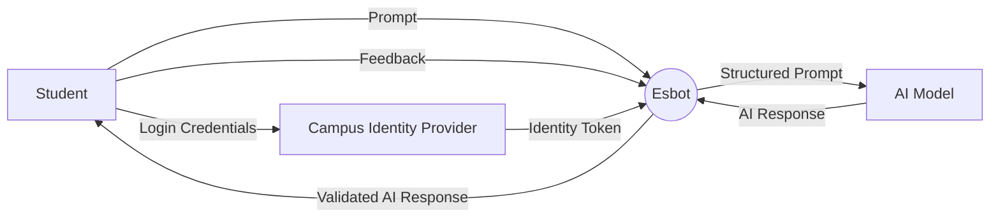

## Context Diagram
Below you will find a context diagram illustrating the relationships the system has with external actors.

```mermaid

graph LR
    Actor1[Student]--Prompt-->System((Esbot))
    Actor1--Feedback-->System
    System--Validated AI Response-->Actor1

    Actor1--Login Credentials-->Actor2[Campus Identity Provider]
    Actor2--Identity Token-->System

    System--Structured Prompt-->Actor3[AI Model]
    Actor3--AI Response-->System

```
