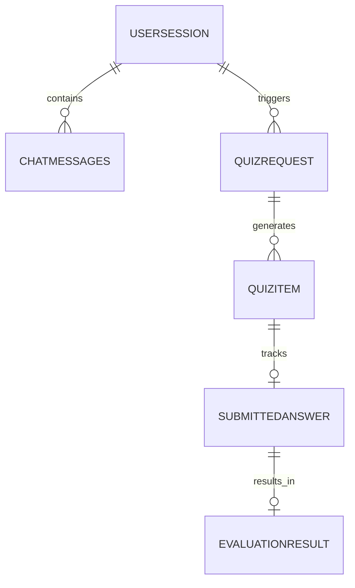

# ESBot Core Data Model Specification

## 1. List of Entities

* UserSession : tracks the lifecycle of an interaction
* ChatMessage : Stores a message based on role (AI or user)
* QuizRequest : Quiz request from the user 
* QuizItem : The AI generated question 
* SubmittedAnswer : User's answer to the question
* Evaluation Result : AI evalutaion of the user's answer

## 2. Relationship Cardinalities

UserSession (1) ↔ (N) ChatMessage: One session contains multiple messages.

UserSession (1) ↔ (N) QuizRequest: A session can trigger multiple quizzes.

QuizRequest (1) ↔ (N) QuizItem: One request generates multiple questions.

QuizItem (1) ↔ (0..1) SubmittedAnswer: Each question has one attempt.

## 3. Persistence Mapping Strategy

Strategy: Relational Mapping using PostgreSQL.

Justification: We chose a relational model because the ESBot data is highly structured with clear dependencies. PostgreSQL provides ACID compliance, which is essential for ensuring that quiz results and chat history are never lost or corrupted during concurrent user sessions.

## 4. Entity Relationship Diagram

