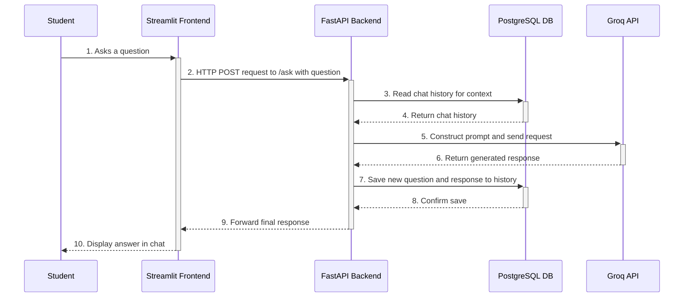

# ESBot - Implementation and Architectural Plan

**Version:** 0.1.0
**Date:** 2026-03-28

## 1. Introduction

This document outlines the architectural design and implementation plan for the ESBot project. It details the integration strategy for the key components: Streamlit (frontend), FastAPI (backend), PostgreSQL (database), and the Groq API (AI inference).

## 2. Architectural Overview

The ESBot application will be built on a decoupled, service-oriented architecture. The frontend and backend will operate as separate processes, communicating via a well-defined RESTful API. This design promotes separation of concerns and allows for independent development and scaling.

### 2.1. Component Responsibilities

- **Streamlit (Frontend):** A Python-based web application responsible for rendering the user interface. It will capture student inputs, display conversations, and manage the client-side state. It is a "thin client" that relies on the backend for all business logic.
- **FastAPI (Backend):** The central nervous system of the application. It will expose API endpoints, process incoming requests, orchestrate interactions between the database and the AI service, and manage the core business logic.
- **PostgreSQL (Database):** The persistence layer. It will store all chat history, ensuring that conversations are recoverable and can be used for providing context in future interactions. It will be managed within a Docker container for environmental consistency.
- **Groq API (AI Service):** An external, third-party service that provides language model inference. The backend will send it carefully constructed prompts, and it will return the generated educational content (answers, quiz questions).

### 2.2. Data Flow Diagram

The following diagram illustrates the flow of information for a standard "Ask Question" request.

## 3. Implementation Plan

The project will be implemented in logical phases to ensure a structured development process.

### Phase 1: Backend and Database Setup

1.  **Initialize FastAPI Project:** Set up the basic FastAPI application structure.
2.  **Define Database Models:** Create SQLAlchemy or a similar ORM model for the `ChatHistory` table in PostgreSQL. The model should include fields for `session_id`, `timestamp`, `actor` (user/bot), and `message_text`.
3.  **Dockerize PostgreSQL:** Write a `docker-compose.yml` file to define and manage the PostgreSQL service.
4.  **Implement Database Connection:** Create a database module in FastAPI to handle the connection to the PostgreSQL container and manage sessions.
5.  **Create API Endpoints:**
    - `POST /ask`: A placeholder endpoint that accepts a question.
    - `POST /quiz`: A placeholder endpoint that accepts a quiz request.
    - `GET /history/{session_id}`: An endpoint to retrieve the chat history for a given session.

### Phase 2: AI Service Integration

1.  **Groq API Client:** Develop a service module within the FastAPI backend to handle all communications with the Groq API. This module will manage the API key (via environment variables) and format the requests.
2.  **Prompt Engineering:** Implement the logic for constructing prompts. This will involve combining the new user question with relevant context retrieved from the chat history (from Phase 1).
3.  **Integrate with Endpoints:** Wire the Groq API client into the `/ask` and `/quiz` endpoints. The backend will now be able to fetch a response from the AI.

### Phase 3: Frontend Development

1.  **Initialize Streamlit App:** Create the main Streamlit application file.
2.  **Build Chat Interface:** Use Streamlit components (`st.chat_input`, `st.chat_message`) to create an intuitive chat interface.
3.  **State Management:** Implement session state management in Streamlit to maintain the conversation history on the client side for the current session.
4.  **API Client:** Write functions to handle HTTP requests to the FastAPI backend endpoints (`/ask`, `/history`).
5.  **Connect UI to Backend:**
    - When the user sends a message, call the `POST /ask` endpoint.
    - On application load, call `GET /history/{session_id}` to load previous messages.
    - Display the response from the backend in the chat window.

### Phase 4: Full Integration and Testing

1.  **End-to-End Testing:** Perform manual tests of the complete user flow for both "Ask Question" and "Generate Quiz" use cases.
2.  **Data Persistence Validation:** Verify that chat history is correctly saved to and retrieved from the PostgreSQL database, especially after restarting the application.
3.  **Refinement:** Refine the UI/UX based on testing feedback. Implement error handling for API failures (e.g., Groq API is down, database connection fails).
4.  **Write Automated Tests:** Develop integration tests to automate the validation of the API endpoints and their interactions with the database and AI service.
