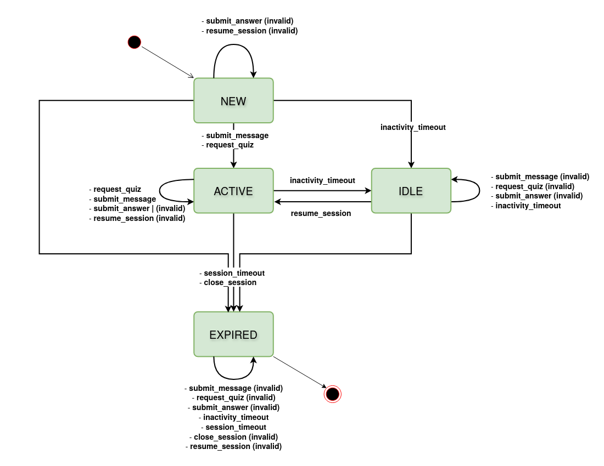

# Test Design Document

## Exercise 7.1: Black-Box Testing Techniques

### Step 1 & 2: Equivalence Class Partitioning (ECP) and Boundary Value Analysis (BVA)

#### Parameter 1: `topic`

**Rules:** The topic string must be between 3 and 100 characters (inclusive).

| Parameter | Class ID | Class Type | Partition Description                  | Representative Test Value     |
| --------- | -------- | ---------- | -------------------------------------- | ----------------------------- |
| `topic`   | EC-T-1   | Valid      | Length is between 3 and 100 characters | "Software Testing" (16 chars) |
| `topic`   | EC-T-2   | Valid      | Length is between 3 and 100 characters | "CPU" (3 chars)               |
| `topic`   | EC-T-3   | Valid      | Length is between 3 and 100 characters | "LLMs" (4 chars)              |
| `topic`   | EC-T-4   | Invalid    | Length is less than 3 characters       | "AI" (2 chars)                |
| `topic`   | EC-T-5   | Valid      | Length is between 3 and 100 characters | "A" repeated 99 times         |
| `topic`   | EC-T-6   | Valid      | Length is between 3 and 100 characters | "A" repeated 100 times        |
| `topic`   | EC-T-7   | Invalid    | Length is greater than 100 characters  | "A" repeated 101 times        |

**Justification for `topic` classes:**

- **EC-T-1 (Valid):** The representative value "Software Testing" is 16 characters long, which safely falls within the valid range. This tests the typical expected input for FR-003.
- **EC-T-2 (Valid):** The representative value "CPU" is 3 characters long, which acts as the boundary value just inside the minimum length (3). This verifies that the system accepts the minimum valid input (NFR-10.2).
- **EC-T-3 (Valid):** The representative value "LLMs" is 4 characters long, which safely falls within the valid range. This tests the typical expected input for FR-003.
- **EC-T-4 (Invalid):** The representative value "AI" is 2 characters long, which acts as the boundary value just outside the minimum length (3). This verifies that the system rejects overly short inputs (NFR-10.2).
- **EC-T-5 (Valid):** The representative value of 99 "A" characters is the boundary value just inside the maximum length (100). This verifies that the system accepts the maximum valid input (NFR-10.2).
- **EC-T-6 (Valid):** The representative value of 100 "A" characters is the maximum valid input. This verifies that the system accepts the maximum valid input (NFR-10.2).
- **EC-T-7 (Invalid):** The representative value of 101 "A" characters is the boundary value just outside the maximum length (100). This ensures the system rejects excessively long input to prevent prompt injection or resource strain (NFR-10.2).

#### Parameter 2: `count`

**Rules:** Must be an integer between 1 and 10 (inclusive).

| Parameter | Class ID | Class Type | Partition Description     | Representative Test Value |
| --------- | -------- | ---------- | ------------------------- | ------------------------- |
| `count`   | EC-C-1   | Invalid    | Integer less than 1       | 0                         |
| `count`   | EC-C-2   | Valid      | Integer between 1 and 10  | 1                         |
| `count`   | EC-C-3   | Valid      | Integer between 1 and 10  | 5                         |
| `count`   | EC-C-4   | Valid      | Integer between 1 and 10  | 10                        |
| `count`   | EC-C-5   | Invalid    | Integer greater than 10   | 11                        |
| `count`   | EC-C-6   | Invalid    | Non-integer / text format | "five"                    |

**Justification for `count` classes:**

- **EC-C-1 (Invalid):** The value 0 acts as the concrete lower boundary value just outside the valid range. It ensures the system safely rejects a request for zero questions (NFR-10.2).
- **EC-C-2 (Valid):** The value 1 acts as the concrete lower boundary value just inside the valid range. It ensures the system accepts the minimum valid input (NFR-8.3).
- **EC-C-3 (Valid):** The value 5 represents a typical integer within the valid range, acting as a standard quiz request for FR-003.
- **EC-C-4 (Valid):** The value 10 acts as the concrete upper boundary value just inside the valid range. It ensures the system accepts the maximum valid input (NFR-8.3).
- **EC-C-5 (Invalid):** The value 11 acts as the concrete upper boundary value just outside the valid range. It prevents excessive load by verifying too many questions cannot be requested (NFR-8.3).
- **EC-C-6 (Invalid):** The value "five" verifies that the system correctly enforces data types and rejects non-numeric input (NFR-10.2).

#### Parameter 3: `difficulty`

**Rules:** Must be one of `easy`, `medium`, or `hard`.

| Parameter    | Class ID | Class Type | Partition Description                 | Representative Test Value |
| ------------ | -------- | ---------- | ------------------------------------- | ------------------------- |
| `difficulty` | EC-D-1   | Valid      | Value is exactly "easy"               | "easy"                    |
| `difficulty` | EC-D-2   | Valid      | Value is exactly "medium"             | "medium"                  |
| `difficulty` | EC-D-3   | Valid      | Value is exactly "hard"               | "hard"                    |
| `difficulty` | EC-D-4   | Invalid    | Any string other than accepted values | "expert"                  |
| `difficulty` | EC-D-5   | Invalid    | Empty or null value                   | ""                        |
| `difficulty` | EC-D-6   | Invalid    | Empty or null value                   | null                      |

**Justification for `difficulty` classes:**

- **EC-D-1, EC-D-2, EC-D-3 (Valid):** The discrete values "easy", "medium", and "hard" are the only valid choices, so each forms its own partition. They map to FR-003 for generating the appropriate quiz difficulty. No numeric boundaries exist.
- **EC-D-4 (Invalid):** The value "expert" checks any valid string not in the enumerated set, ensuring the system defaults or rejects unhandled difficulties (NFR-10.2).
- **EC-D-5 (Invalid):** An empty string represents the missing string value edge case, ensuring the system handles missing required data (NFR-10.2).
- **EC-D-6 (Invalid):** A null value represents the non-string edge case, ensuring the system handles missing required data (NFR-10.2).

---

### Step 3: Decision Table for Answer Evaluation

The answer evaluation feature (FR-004) generates feedback based on three main conditions:

1. **Answer correctness:** Correct (C), Partially correct (P), Incorrect (I)
2. **Answer is empty or blank:** Yes (Y), No (N)
3. **Quiz item still exists in session:** Yes (Y), No (N)

| Rule | C1: Correctness | C2: Empty | C3: Exists | Expected Action / Output                                  | Requirement / Edge Case                          |
| ---- | --------------- | --------- | ---------- | --------------------------------------------------------- | ------------------------------------------------ |
| R1   | -               | -         | N          | Return controlled error: "Quiz item not found or expired" | FR-4 / Edge case: session expired / missing item |
| R2   | -               | Y         | Y          | Prompt user to provide an answer                          | FR-4 / Edge case: empty input                    |
| R3   | C               | N         | Y          | Provide positive feedback and mark item as solved         | FR-4.1, FR-4.3                                   |
| R4   | P               | N         | Y          | Provide constructive feedback with hints                  | FR-4.1, FR-4.3                                   |
| R5   | I               | N         | Y          | Provide explanatory feedback with the correct answer      | FR-4.1, FR-4.3                                   |

_(Note: The `-` denotes a "don't-care" condition. If the quiz item no longer exists, neither the correctness nor whether the answer is empty matter. If the answer is empty, correctness is irrelevant since it cannot be evaluated.)_

---

## Exercise 7.2: State Transition Testing — Learning Session Lifecycle

### Step 1: State Transition Diagram

### Step 2: State Transition Table

| Current State | Event                | Next State              | Output / Action                                                                                                             |
| ------------- | -------------------- | ----------------------- | --------------------------------------------------------------------------------------------------------------------------- |
| `NEW`         | `submit_message`     | `ACTIVE`                | Message accepted. Generate response.                                                                                        |
| `NEW`         | `request_quiz`       | `ACTIVE`                | Request accepted. If not provided, ask for topic or material to generate quiz.                                              |
| `NEW`         | `submit_answer`      | – (invalid)             | Return controlled error: "No active quiz item to answer."                                                                   |
| `NEW`         | `inactivity_timeout` | `IDLE`                  | No interactions recorded. Further messages will require resume_session.                                                     |
| `NEW`         | `session_timeout`    | `EXPIRED`               | Session lifetime exceeded. No further interactions accepted.                                                                |
| `NEW`         | `close_session`      | `EXPIRED`               | Session terminated by user/system. No further interactions accepted.                                                        |
| `NEW`         | `resume_session`     | – (invalid)             | Return controlled error: "A NEW session cannot be resumed."                                                                 |
| `ACTIVE`      | `submit_message`     | `ACTIVE`                | Message accepted. Generate response.                                                                                        |
| `ACTIVE`      | `request_quiz`       | `ACTIVE`                | Request accepted. If not provided, ask for topic or material to generate quiz.                                              |
| `ACTIVE`      | `submit_answer`      | `ACTIVE` or – (invalid) | If active quiz item exists, evaluate answer and return feedback. Otherwise, return controlled error: "No active quiz item." |
| `ACTIVE`      | `inactivity_timeout` | `IDLE`                  | No interactions recorded. Further messages will require resume_session.                                                     |
| `ACTIVE`      | `session_timeout`    | `EXPIRED`               | Session lifetime exceeded. No further interactions accepted.                                                                |
| `ACTIVE`      | `close_session`      | `EXPIRED`               | Session terminated by user/system. No further interactions accepted.                                                        |
| `ACTIVE`      | `resume_session`     | – (invalid)             | Return controlled error: "An ACTIVE session cannot be resumed."                                                             |
| `IDLE`        | `submit_message`     | – (invalid)             | Return controlled error: "Messages cannot be submitted on a session in IDLE state."                                         |
| `IDLE`        | `request_quiz`       | – (invalid)             | Return controlled error: "Quizzes cannot be requested on a session in IDLE state."                                          |
| `IDLE`        | `submit_answer`      | – (invalid)             | Return controlled error: "Answers cannot be submitted on a session in IDLE state."                                          |
| `IDLE`        | `inactivity_timeout` | `IDLE`                  | No interaction recorded. Already IDLE.                                                                                      |
| `IDLE`        | `session_timeout`    | `EXPIRED`               | Session lifetime exceeded. No further interactions accepted.                                                                |
| `IDLE`        | `close_session`      | `EXPIRED`               | Session terminated by user/system. No further interactions accepted.                                                        |
| `IDLE`        | `resume_session`     | `ACTIVE`                | Session resumes. Wait for input.                                                                                            |
| `EXPIRED`     | `submit_message`     | – (invalid)             | Return controlled error: "Messages cannot be submitted on an EXPIRED session."                                              |
| `EXPIRED`     | `request_quiz`       | – (invalid)             | Return controlled error: "Quizzes cannot be requested on an EXPIRED session."                                               |
| `EXPIRED`     | `submit_answer`      | – (invalid)             | Return controlled error: "Answers cannot be submitted on an EXPIRED session."                                               |
| `EXPIRED`     | `inactivity_timeout` | `EXPIRED`               | Event ignored. Session already EXPIRED.                                                                                     |
| `EXPIRED`     | `session_timeout`    | `EXPIRED`               | Event ignored. Session already EXPIRED.                                                                                     |
| `EXPIRED`     | `close_session`      | – (invalid)             | Return controlled error: "An EXPIRED session cannot be closed."                                                             |
| `EXPIRED`     | `resume_session`     | – (invalid)             | Return controlled error: "An EXPIRED session cannot be resumed."                                                            |

### Step 3: Test Case Derivation (All-Transitions Coverage)

The following test sequences together cover **every valid transition at least once**, plus one sequence that exercises an invalid transition. Each sequence starts from the implied start state of a freshly created session (`NEW`).

#### TS-1: Typical Learning Session — Happy Path with Idle Recovery

**Verifies:** FR-001, FR-002, FR-003, FR-004, FR-005
**Start state:** `NEW`

| Step | Event                | Expected State | Expected Output                                    |
| ---- | -------------------- | -------------- | -------------------------------------------------- |
| 1    | `submit_message`     | `ACTIVE`       | Message accepted; response generated               |
| 2    | `request_quiz`       | `ACTIVE`       | Quiz request accepted; quiz items generated        |
| 3    | `submit_answer`      | `ACTIVE`       | Answer evaluated; feedback returned (FR-004)       |
| 4    | `inactivity_timeout` | `IDLE`         | Session marked idle; further input requires resume |
| 5    | `resume_session`     | `ACTIVE`       | Session resumes; ready for input                   |
| 6    | `submit_message`     | `ACTIVE`       | Message accepted; response generated               |
| 7    | `close_session`      | `EXPIRED`      | Session terminated                                 |
| 8    | `inactivity_timeout` | `EXPIRED`      | Event ignored; session already EXPIRED             |
| 9    | `session_timeout`    | `EXPIRED`      | Event ignored; session already EXPIRED             |

**Transitions covered:** NEW→ACTIVE (submit_message), ACTIVE→ACTIVE (request_quiz), ACTIVE→ACTIVE (submit_answer), ACTIVE→IDLE (inactivity_timeout), IDLE→ACTIVE (resume_session), ACTIVE→ACTIVE (submit_message), ACTIVE→EXPIRED (close_session), EXPIRED→EXPIRED (inactivity_timeout), EXPIRED→EXPIRED (session_timeout).

---

#### TS-2: Quiz-First Path with Session Lifetime Expiry

**Verifies:** FR-003, FR-005
**Start state:** `NEW`

| Step | Event             | Expected State | Expected Output                             |
| ---- | ----------------- | -------------- | ------------------------------------------- |
| 1    | `request_quiz`    | `ACTIVE`       | Quiz request accepted; quiz items generated |
| 2    | `session_timeout` | `EXPIRED`      | Session lifetime exceeded; no further input |

**Transitions covered:** NEW→ACTIVE (request_quiz), ACTIVE→EXPIRED (session_timeout).

---

#### TS-3: Idle From Start → Repeated Idle → Expiry

**Verifies:** FR-005, edge case "session state missing or expired"
**Start state:** `NEW`

| Step | Event                | Expected State | Expected Output                               |
| ---- | -------------------- | -------------- | --------------------------------------------- |
| 1    | `inactivity_timeout` | `IDLE`         | Session marked idle without prior interaction |
| 2    | `inactivity_timeout` | `IDLE`         | Already IDLE; no state change                 |
| 3    | `session_timeout`    | `EXPIRED`      | Session lifetime exceeded                     |

**Transitions covered:** NEW→IDLE (inactivity_timeout), IDLE→IDLE (inactivity_timeout), IDLE→EXPIRED (session_timeout).

---

#### TS-4: Immediate Close From NEW

**Verifies:** FR-005
**Start state:** `NEW`

| Step | Event           | Expected State | Expected Output    |
| ---- | --------------- | -------------- | ------------------ |
| 1    | `close_session` | `EXPIRED`      | Session terminated |

**Transitions covered:** NEW→EXPIRED (close_session).

---

#### TS-5: Immediate Session Timeout From NEW

**Verifies:** FR-005
**Start state:** `NEW`

| Step | Event             | Expected State | Expected Output           |
| ---- | ----------------- | -------------- | ------------------------- |
| 1    | `session_timeout` | `EXPIRED`      | Session lifetime exceeded |

**Transitions covered:** NEW→EXPIRED (session_timeout).

---

#### TS-6: Idle Then User Closes Session

**Verifies:** FR-005
**Start state:** `NEW`

| Step | Event                | Expected State | Expected Output                      |
| ---- | -------------------- | -------------- | ------------------------------------ |
| 1    | `submit_message`     | `ACTIVE`       | Message accepted; response generated |
| 2    | `inactivity_timeout` | `IDLE`         | Session marked idle                  |
| 3    | `close_session`      | `EXPIRED`      | Session terminated from IDLE         |

**Transitions covered:** IDLE→EXPIRED (close_session). (Reuses NEW→ACTIVE and ACTIVE→IDLE already covered in TS-1.)

---

#### TS-7: Invalid Transition — Submit on EXPIRED Session

**Verifies:** FR-009 (controlled error handling), NFR-003 (graceful degradation), edge case "session expired"
**Start state:** `NEW`

| Step | Event            | Expected State | Expected Output                                                                                    |
| ---- | ---------------- | -------------- | -------------------------------------------------------------------------------------------------- |
| 1    | `close_session`  | `EXPIRED`      | Session terminated                                                                                 |
| 2    | `submit_message` | – (invalid)    | Controlled error: "Messages cannot be submitted on an EXPIRED session." Session remains `EXPIRED`. |

**Transitions covered:** Invalid transition path — verifies the system returns a controlled error rather than crashing or accepting the request.

---

#### Coverage Summary

| Valid Transition                             | Covered By |
| -------------------------------------------- | ---------- |
| `NEW` → `ACTIVE` (`submit_message`)          | TS-1       |
| `NEW` → `ACTIVE` (`request_quiz`)            | TS-2       |
| `NEW` → `IDLE` (`inactivity_timeout`)        | TS-3       |
| `NEW` → `EXPIRED` (`session_timeout`)        | TS-5       |
| `NEW` → `EXPIRED` (`close_session`)          | TS-4       |
| `ACTIVE` → `ACTIVE` (`submit_message`)       | TS-1       |
| `ACTIVE` → `ACTIVE` (`request_quiz`)         | TS-1       |
| `ACTIVE` → `ACTIVE` (`submit_answer`)        | TS-1       |
| `ACTIVE` → `IDLE` (`inactivity_timeout`)     | TS-1, TS-6 |
| `ACTIVE` → `EXPIRED` (`session_timeout`)     | TS-2       |
| `ACTIVE` → `EXPIRED` (`close_session`)       | TS-1       |
| `IDLE` → `IDLE` (`inactivity_timeout`)       | TS-3       |
| `IDLE` → `EXPIRED` (`session_timeout`)       | TS-3       |
| `IDLE` → `EXPIRED` (`close_session`)         | TS-6       |
| `IDLE` → `ACTIVE` (`resume_session`)         | TS-1       |
| `EXPIRED` → `EXPIRED` (`inactivity_timeout`) | TS-1       |
| `EXPIRED` → `EXPIRED` (`session_timeout`)    | TS-1       |
| Invalid transition (controlled error)        | TS-7       |

All 17 valid transitions are exercised at least once → **all-transitions coverage achieved.**

---

AI assistance was used to transcribe hand-drawn tables into structured Markdown tables.

## Exercise 7.3: Reflection — Test Design Technique Comparison

### 1. Complementarity

The three black-box testing techniques complement each other perfectly by targeting different structural aspects of the ESBot system:

- **ECP/BVA:** This technique is best suited for input validation and boundaries. For ESBot, it was effectively applied to the `QuizRequest` parameters to ensure the system handles valid limits and safely rejects out-of-bound inputs, such as rejecting a 101-character topic (EC-T-7) or an excessive question count of 11 (EC-C-5).
- **Decision Tables:** This technique excels when system behavior depends on combinations of independent logical conditions. For ESBot, the answer evaluation feature (FR-004) was best covered here. The table cleanly maps how feedback dynamically changes based on correctness, input presence, and session validity (e.g., Rule R1 explicitly shows that correctness is irrelevant if the quiz item no longer exists).
- **State Transition Testing:** This technique is ideal for stateful components with specific lifecycles. For ESBot, it effectively modeled the `UserSession` (FR-005), ensuring that operations are context-aware. For example, test sequence TS-7 proves that the system correctly rejects a `submit_message` event if the session has dropped into an `EXPIRED` state.

### 2. Gaps

While these techniques cover structured inputs, logic, and state transitions, they fail to adequately test the **non-deterministic behavior of the AI integration** (the core value of ESBot). Since LLMs generate dynamic text, standard black-box techniques cannot easily verify the "accuracy," "hallucination rate," or semantic quality of contextualized answers.

- **Alternative Technique:** To address this gap, **Metamorphic Testing** or **Exploratory Testing** would be highly beneficial. Metamorphic testing could verify that asking the same question with slightly different phrasing yields semantically equivalent answers without needing an exact string match. Exploratory testing would allow testers to probe the AI for edge-case prompts, inappropriate content requests, or prompt injection attacks, which strict boundary value analysis cannot catch.

### 3. Effort vs. Value

For the ESBot project, the **Decision Table** technique produced the highest defect-detection value relative to the design effort. Constructing the table for the Answer Evaluation feature (FR-004) required mapping out only three conditions, but it immediately exposed critical edge cases that developers frequently miss. For instance, without the structured approach of the decision table, a developer might write the AI evaluation call before checking if the `QuizItem` still exists in the database (Rule R1) or if the answer string is completely empty (Rule R2). By investing a small amount of effort into the decision table, we mapped out a robust logic flow that prevents severe runtime crashes and ensures NFR-003 (graceful degradation) is maintained.

Google Gemini was used to help writing this part of the exercise and all content was thoroughly checked.
