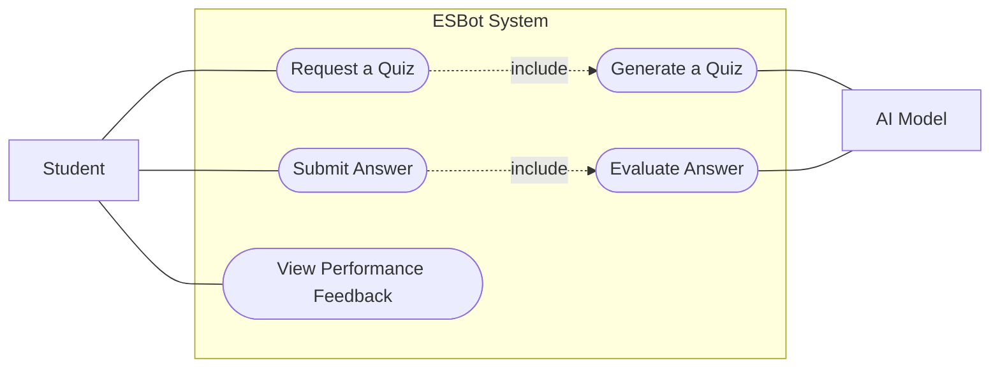

## Use Case Diagram

For this use case diagram, the chosen features are "Quiz and Practice Generation" and "Answer Evaluation". Below is the use case diagram for said features:

## Use Case Descriptions

### "Request a Quiz" Use Case Description

Use Case ID: UC-001

Title: Request a Quiz

Primary Actor: Student

Stakeholders and Interests:

    -Student: Wants to generate a quiz based on a topic they provide

Preconditions:

    -Student has logged in to their account

    -AI model is active and connected

Trigger: 

    -Student gives a prompt to the system asking for a quiz

Main Success Scenario:

    1. User opens the chat bot's page
    2. User types a prompt
    3. User submits the prompt
    4. System structures the prompt
    5. System sends the structured prompt to the AI model

Postconditions:

    - User prompt is sent to the AI model
    - User sees on the chat screen that the AI model is thinking

Extensions (Alternate Flows):
    
    - 5a. Prompt Sending Fails:
        - 5a1. System notifies the user

Special Requirements:

    - User prompt must ask of a quiz and must provide a topic

Frequency of Use:

    - Frequently (every user can request a quiz more than once per day)

### "Generate a Quiz" Use Case Description

Use Case ID: UC-002

Title: Generate a Quiz

Primary Actor: AI Model

Stakeholders and Interests:

    - AI Model: Wants to generate a quiz based on the prompt given
    - Student: Wants to get a quiz based on the prompt they have given

Preconditions:

    - AI model is active and connected

Trigger:

    - Student gives a prompt to the system requesting a quiz

Main Success Scenario:

    1. AI model receives a structured prompt from the system
    2. Model generates a quiz question and a corresponding "correct" answer
    3. Model sends the generated content back to the system
    4. System parses the response to ensure it meets the required format.
    5. System displays the quiz on the student's screen

Postconditions:

    - The generated quiz is visible to the student
    - System awaits student answer

Extensions (Alternate Flows):

    - 2a. Rejection of the Prompt:
        - 2a1. AI model determines the prompt violates safety guidelines
        - 2a2. Model informs the student that it will not fulfill the spesific request.
    
    - 4a. Parsing Error:
        - 4a1. Model returns unstructured text
        - 4a2. System requests another result from the AI model

Special Requirements:

    - Prompt must ask for a quiz and must provide a topic

Frequency of Use:
    - Frequently (Everytime a quiz request is done)

### "Submit Answer" Use Case Description

Use Case ID: UC-003

Title: Submit Answer

Primary Actor: Student

Stakeholders and Interests:

    - Students: Wants to submit their answer to the question provided to them

Preconditions:

    - A quiz question must be generated

Trigger:

    - Student chooses/types their answer and then clicks on the submit button

Main Success Scenario:

    1. Student chooses/types their answer
    2. Student clicks "Submit"
    3. System sends the answer to the AI model for evaluation

Postconditions:

    - Student answer is given to the AI model for evaluation
    - Student is waiting for their evaluation

Extensions (Alternate Flows):

    - 3a. Invalid Input:
        - 3a1. Student answer is found harmful/irrelevant by the model
        - 3a2. Student gets notified, and gets asked to submit another answer

Special Requirements:

    - Student answer should be relevant to the question

Frequency of Use:

    -Frequently (Every time a student is asked a quiz question)

## "Evaluate Answer" Use Case Description

Use Case ID: UC-004

Title: Evaluate Answer

Primary Actor: AI Model

Stakeholders and Interests:

    - Student: Wants a feedback about their answer

    - AI Model: Needs to process the student's input against the context of the question

Preconditions:

    - A student answer must be submitted and transmitted to the AI Model

    - AI Model must have the correct criteria or solution to check against the Student answer

Trigger:

    - AI Model receives the student's answer and the evaluation prompt fromthe system

Main Success Scenario:

    1. AI Model checks the student answer against the correct criteria
    2. AI Model identifies the correct and incorrect parts in the answer
    3. AI Model generates pedagogical feedback with explanations and tips
    4. AI MOdel sends the evaluation result and feedback back to the system

Postconditions:

    - The evaluation is sent to the system, ready to be displayed on student's screen

Extensions (Alternate Flows):

    - 1a. Unclear Answer:

        -1a1. AI Model can not determine if the answer is correct or incorrect.
        - 1a2. AI Model genereates a clarification question instead of a grade
    
    - 4a. Connection Failure:

        - 4a1. System loses connection during evaluation
        - 4a2. System tries to resend the evaluation request

Special Requirements:

    - Evaluation must be performes within 5 seconds to meet the "Performance Non-Functional Requirement"

Frequency of Use:

    - Frequently (Every time an answer is submitted)

## "View Performance Feedback" Use Case Description

Use Case ID: UC-005

Title: View Performance Feedback 

Primary Actor: Student

Stakeholders and Interests:

    -Student: Wants to see their results

Preconditions: 

    - The evaluation is completed successfully

Trigger:

    The System finishes processing AI evaluation

Main Success Scenario:

    1. System gets the feedback from the AI Model
    2. System renders the feedback on the chat screen
    3. Student reviews the feedback

Postconditions:

    - Student is informed about their performance
    - Session context is updated so that the student can ask follow up questions

Extensions (Alternate Flows):

    - 1a. Display Error:
        -1a1. System fails to render the AI's feedback 
        -1a2. Student clicks "refresh"

Frequency of Use:

    - Frequently (Following every evaluated answer)

